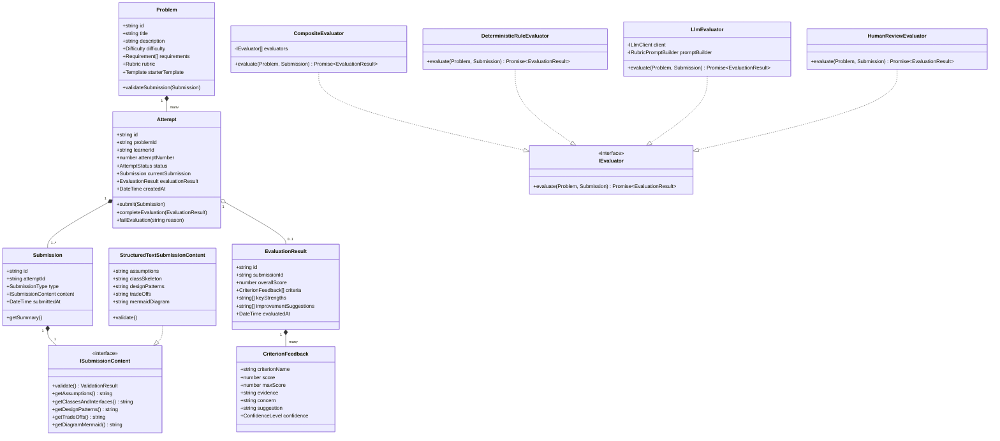

# Design Note: LLD Practice Platform Architecture & Domain Model

**Author:** Mainak Pal   
**Project:** CipherSchools Engineering Assignment  
**Scope:** Monolithic MVP with Clean Domain Boundaries  
**Target:** 2-Day Engineering Prototype  

---

## 1. System Overview & The Practice Loop

The **LLD Practice Platform** is built to facilitate deliberate practice in Object-Oriented and Low-Level System Design. The system architecture is centered entirely around the learner's feedback loop:

$$\boxed{\text{Problem Selection}} \longrightarrow \boxed{\text{Structured Design Draft}} \longrightarrow \boxed{\text{Asynchronous Submission}} \longrightarrow \boxed{\text{Rubric Evaluation}} \longrightarrow \boxed{\text{Progression Review \& Retry}}$$

Rather than attempting to build a generic LMS or heavy distributed microservices, this system is implemented as a **modular monolith** with clean separation between the **Domain Model**, **Evaluation Strategies**, **Application Services**, and **Presentation Layer**.

---

## 2. Core Domain Model & Class Responsibilities

The domain layer is completely decoupled from web frameworks, UI libraries, or database drivers. Every abstraction exists for a specific domain necessity.

### Domain Class Responsibilities:
1. **`Problem`**: Holds the domain specification, functional/non-functional constraints, and the grading `Rubric`. It acts as the immutable reference criteria.
2. **`Attempt`**: Manages the lifecycle of a learner's engagement with a problem. Governs the state machine:
   $$\text{DRAFT} \longrightarrow \text{SUBMITTED} \longrightarrow \text{EVALUATING} \longrightarrow \text{COMPLETED} \quad (\text{or } \text{FAILED})$$
   Enforces idempotency and guarantees state integrity.
3. **`Submission`**: Represents the immutable snapshot of a candidate's design at a specific point in time. It encapsulates an `ISubmissionContent`.
4. **`ISubmissionContent`**: Polymorphic interface defining what constitutes a valid design representation.
5. **`EvaluationResult` & `CriterionFeedback`**: Highly structured evaluation artifact. Instead of a single opaque number, it provides a breakdown across 6 core LLD dimensions.
6. **`IEvaluator`**: Strategy interface for evaluating a submission against a problem rubric.

---

## 3. Addressing the 5 Main Design Questions

### Q1: What does a learner actually need to provide for an LLD attempt to be meaningful?
**Decision:** A meaningful LLD attempt does *not* require thousands of lines of boilerplate compilable code. Compilable code in Java/C++ often obscures design intent with syntactical overhead.  
A learner must provide **four essential structural components**:
1. **Clarifying Assumptions & Scope:** What is in-scope vs. out-of-scope (e.g., single parking garage vs. distributed chain; payment processing as an abstract gateway).
2. **Entity & Interface Hierarchy:** Concrete classes, abstract classes, interfaces, attributes, and method signatures demonstrating polymorphic design.
3. **Design Patterns & Relationship Rationale:** Explicit justification for chosen patterns (e.g., Why Strategy for Spot Allocation? Why State for Elevator/Vending Machine?).
4. **Edge Cases, Concurrency & Trade-offs:** How the design handles race conditions (e.g. two cars claiming the same parking spot), capacity limits, and transactional rollbacks.

### Q2: What makes feedback useful when there can be more than one valid LLD solution?
**Decision:** Feedback must never treat a reference solution as the sole canonical truth. Instead, feedback is evaluated against **axiomatic object-oriented principles (SOLID)** using a **Rubric-Driven Evaluation Shape**:
$$\text{Criterion} \longrightarrow \text{Score} \longrightarrow \text{Direct Evidence} \longrightarrow \text{Identified Concern} \longrightarrow \text{Actionable Suggestion}$$
- If Design A uses Strategy and Design B uses Command, both receive full marks for abstraction *if* they decouple callers from implementations.
- Feedback points to the learner's actual text/diagram tokens (e.g., *"In your `ParkingSpot` class, the `calculateFee()` method couples spot state with billing rules"*).

### Q3: Which parts of evaluation should be deterministic, and which parts benefit from an LLM?
We separate concerns strictly:

| Evaluation Dimension | Evaluator Engine | Rationale |
| :--- | :--- | :--- |
| **Completeness & Structure** | **Deterministic** | Verifies presence of required sections, non-empty assumptions, minimum class count, and presence of interfaces. |
| **Relationship & Syntax Integrity** | **Deterministic** | Validates Mermaid diagram syntax, verifies that referenced types exist, and checks for cyclical inheritance. |
| **Submission State & Idempotency** | **Deterministic** | State machine transitions, token deduplication, retry limits. |
| **Single Responsibility & Cohesion** | **LLM (Rubric-Guided)** | Requires semantic reasoning to judge whether an object possesses too many disparate reasons to change. |
| **Pattern Appropriateness** | **LLM (Rubric-Guided)** | Evaluates whether a chosen pattern solves a real flexibility problem or is speculative over-engineering. |
| **Extensibility & Trade-offs** | **LLM (Rubric-Guided)** | Tests how well the design accommodates future requirement changes (e.g., adding an EV charging spot or new billing tier). |

### Q4: How does the design accommodate another evaluation approach or another submission format? (The Two Change Tests)

#### Change Test A: Learner submits text today; later the platform supports interactive class diagrams.
- **Impact on Domain Model:** **Zero changes to core domain logic.**
- **How it works:** The domain defines `ISubmissionContent`. Today we implement `StructuredTextSubmissionContent`. When a visual diagram editor (e.g. Draw.io or React Flow) is added, we simply introduce `VisualDiagramSubmissionContent implements ISubmissionContent`. The `Submission` entity, `Attempt` state machine, and `IEvaluator` interfaces remain untouched.

#### Change Test B: Feedback comes from one evaluator today; later rule-based evaluators or human review are added.
- **Impact on Practice Flow:** **Zero changes to the practice service or learner flow.**
- **How it works:** We employ the **Composite Pattern** via `CompositeEvaluator implements IEvaluator`. The practice service depends strictly on `IEvaluator`. To incorporate human review, we add `HumanReviewEvaluator implements IEvaluator` or route the submission to a reviewer queue. The learner's attempt lifecycle remains identical (`SUBMITTED` $\rightarrow$ `EVALUATING` $\rightarrow$ `COMPLETED`).

### Q5: What should happen if evaluation takes time or fails?
**Decision:** Asynchronous execution with state preservation:
1. **Immediate Persistence:** When the learner clicks Submit, the submission is persisted synchronously with status `SUBMITTED`. The API responds immediately with `202 Accepted` and the `attemptId`. The learner is never blocked by slow external AI inference.
2. **Background Job Runner:** An in-process `EvaluationJobRunner` picks up the attempt, transitions status to `EVALUATING`, and executes the evaluator pipeline.
3. **Graceful Failure & Resilient Retry:** If an LLM call times out or throws an error:
   - The attempt transitions to `FAILED` with a descriptive user-friendly message.
   - The learner's submitted design is **never lost**.
   - A deterministic baseline score is provided as an immediate fallback, or the learner can trigger a one-click "Retry Evaluation" without retyping their solution.
4. **Idempotency Guard:** If a learner double-clicks or retries while evaluation is in progress, the state machine rejects concurrent evaluations with a `409 Conflict / In-Progress` guard.

---

## 4. Evaluation Rubric Dimensions (Fixed Shape)

The platform evaluates submissions across 6 weighted dimensions (each scored 0–10 or 0–5 normalized):
1. **Requirements & Scope Understanding (15%):** Correct identification of primary use cases, edge scenarios, and clear boundary assumptions.
2. **Class Responsibilities & SRP (25%):** Clean cohesion; classes have a single, well-defined reason to change.
3. **Coupling, Encapsulation & Interfaces (20%):** Loose coupling through abstractions/interfaces; information hiding.
4. **Design Pattern Appropriateness (15%):** Justified use of Strategy, State, Factory, Observer, or Decorator where applicable.
5. **Extensibility & Evolution (15%):** Ability of the design to absorb new requirements with minimal code modification (Open/Closed Principle).
6. **Concurrency & Edge Cases (10%):** Consideration of thread safety, race conditions, null states, and transactional rollbacks.

---

## 5. Architectural Scalability & Future Separation

For this 2-day MVP, a **single Node.js/TypeScript monolith** is the optimal engineering decision:
- Zero inter-process network overhead.
- Shared domain types between backend and frontend.
- Trivial local setup (`npm run dev`) with no Kubernetes or Docker orchestration needed.

**If the product scales to thousands of concurrent learners**, the simplest component to separate first is the **`EvaluationWorker`**:
- The API server remains lightweight, simply persisting submissions to PostgreSQL and pushing an event to Redis/SQS.
- Independent worker nodes consume from the queue and invoke LLMs / sandboxed analyzers without impacting UI responsiveness.
